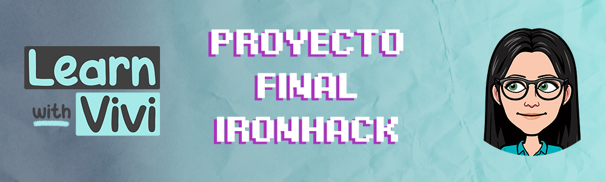
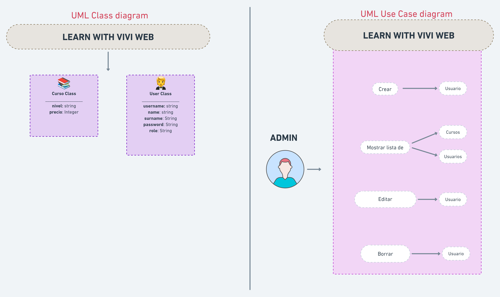

> Hola 👋 Soy Agus!. </br>
> Desarrolle una web para clases de ingles impartidas por mi tía Viviana. El nombre de la web es Learn with Vivi
> Veamos de que se trata el proyecto en mas detalle 🧐
## Cómo funciona:


So... as any other banking services app, this one allows the users to have their own accounts (in the image above you can distinguish the different account types),
make money transfers and earn interests from the savings and checking accounts in case they have them. </br> </br>
Lets now take a look on the methods that allows us to execute these actions: </br>
<li type="square"><b>addInterestCreditCard():</b> this method calculates the monthly interest rate for the credit account and apply it to the account every month
. You can find it on the CreditAccount class.</li>
<li type="square"><b>addInterestSavingsAccount():</b> similarly to the method explained above, this one will apply interests for the saving accounts which are annual.</li>
<li type="square"><b>calculateAge():</b> this method will calculate the age of the future account holder. When creating a new checking account, it will be useful as 
it will distinguish adult owners the student ones.</li>
<li type="square"><b>applyPenaltyFee():</b> aahh! This method is the most hated by the future users (if that makes sense). It will penalize those accounts whose balance
fall below the minimum required.</li>
<li type="square"><b>transferMoney():</b> as its name indicates, it allows the users to make money transfers between accounts.</li>
</br>

## Setup

- Fork this repo
- Clone this repo

```shell
$ git clone <NameOfRepository>
$ cd IronLibrary
```

- Open folder in IntelliJ IDEA
- Run program
